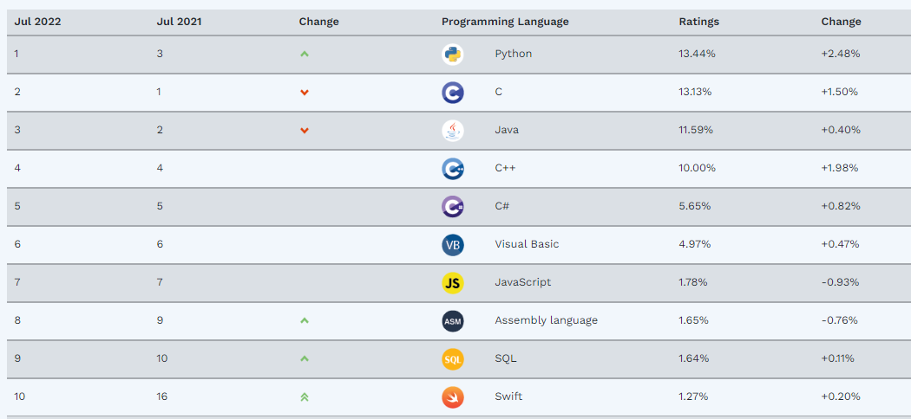
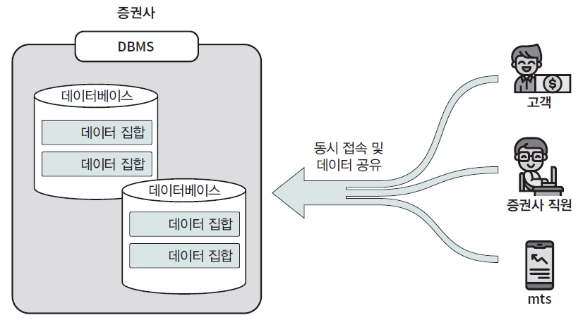

# Chapter1 퀀트에 대해 알아보기
* 퀀트란?
  * 모형을 기반으로 금융상품의 가격을 산정하거나, 이를 바탕으로 투자하는 사람(방법)
* 정성적 투자법 vs 정량적 투자법
  * 정성적 투자법
    * 사업과 기업을 분석해 가치 산정
  * 정량적 투자법
    * 수학, 통계, 데이터를 기반으로 전략을 만들고 이를 바탕으로 투자

  | 분류 | 퀀트 투자 | 정성적 투자 | 
  | --- | --- | --- | 
  | 객관성 | 높음 | 낮음 | 
  | 투자기회 | 많음 | 작음 | 
  | 감정적 요인 | 낮음 | 높음 | 
  | 반복 가능성 | 높음 | 낮음 | 
  | 위험통제능력 | 높음 | 낮음 |
## 1.1 퀀트 투자의 핵심 재료, 데이터
* 데이터를 구하는 방법?
  * 무료 API
  * 유료 구매
  * 웹 스크래핑
    * 특정 웹사이트만을 추적
  * 웹 크롤링
    * 링크를 타고 탐색
## 1.2 퀀트 투자에 프로그래밍이 필요한 이유
* 효율적인 데이터 수집, 클렌징 작업, 백테스트, 종목 선정을 위해
## 1.3 최고의 인기 언어, 파이썬
 
* stackoverflow rank
  * https://survey.stackoverflow.co/2022/#technology-most-popular-technologies
## 1.4 데이터 관리의 표준, SQL
 