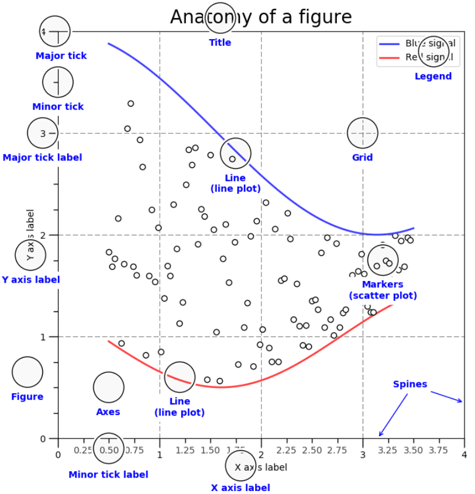
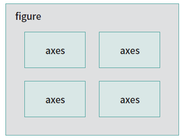
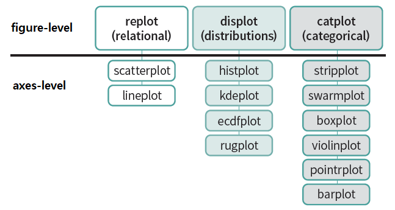

# Chapter4 데이터 시각화 배워 보기
## 4.1 그래프의 구성 요소

* 하나의 figure내에는 여러개의 axes가 그려질 수 있다.

## 4.2 matplotlib 패키지를 이용한 시각화
* ex) 펭귄의 날개와 몸무게 - scatter
``` 
import seaborn as sns
import matplotlib.pyplot as plt
df = sns.load_dataset('penguins')
plt.scatter(df['flipper_length_mm'], df['body_mass_g'])
plt.show()
```
* ex) 펭귄의 종에 따른 평균 무게
``` 
df_group = df.groupby('species')['body_mass_g'].mean().reset_index()
plt.bar(x=df_group['species'], height = df_group['body_mass_g'])
plt.show()
```
* ex) 펭귄의 몸무게 분포
``` 
plt.rc('font', family='Malgun Gothic')
plt.hist(df['body_mass_g'], bins=30)
plt.xlabel('Body Mass')
plt.ylabel('Count')
plt.title('펭귄의 몸무게 분포')
plt.show()
```
* ex) 미국 실업자 데이터 로드
``` 
import pandas as pd

df_unrate = pd.read_csv('https://research.stlouisfed.org/fred2/series/UNRATE/downloaddata/UNRATE.csv')
df_unrate.head()
df_unrate.tail()
```
* ex) 미국 실업자 선 그래프로 표시
``` 
df_unrate.info()
df_unrate['DATE'] = pd.to_datetime(df_unrate['DATE'])
plt.plot(df_unrate['DATE'], df_unrate['VALUE'])
plt.show()
```
### 4.2.1 한 번에 여러개의 그래프 나타내기
* stateless API(objected-based)
  * 내가 지정한 figure, 내가 지정한 axes에 그림을 그리는 방법
* stateful API(state-based)
  * 현재의 figure, 현재의 axes에 그림을 그리는 방법
* stateless 방법
``` 
fig, axes = plt.subplots(2, 1, figsize=(10, 6))

# 첫번째 그림
axes[0].scatter(df['flipper_length_mm'], df['body_mass_g'])
axes[0].set_xlabel('날개 길이(mm)')
axes[0].set_ylabel('몸무게(g)')
axes[0].set_title('날개와 몸무게간의 관계')

# 두번째 그림
axes[1].hist(df['body_mass_g'], bins=30)
axes[1].set_xlabel('Body Mass')
axes[1].set_ylabel('Count')
axes[1].set_title('펭귄의 몸무게 분포')

# 간격 조정
plt.subplots_adjust(
    left=0.1,
    right=0.95,
    bottom=0.1,
    top=0.95,
    wspace=0.5,
    hspace=0.5
)

plt.show()
```
* stateful 방법
``` 
plt.figure(figsize=(10, 6))

# 첫번째 그림
plt.subplot(2, 1, 1)
plt.scatter(df['flipper_length_mm'], df['body_mass_g'])
plt.xlabel('날개 길이(mm)')
plt.ylabel('몸무게(g)')
plt.title('날개와 몸무게간의 관계')

# 두번째 그림
plt.subplot(2, 1, 2)
plt.hist(df['body_mass_g'], bins=30)
plt.xlabel('Body Mass')
plt.ylabel('Count')
plt.title('펭귄의 몸무게 분포')

# 간격 조정
plt.subplots_adjust(
    left=0.1,
    right=0.95,
    bottom=0.1,
    top=0.95,
    wspace=0.5,
    hspace=0.5
)

plt.show()
```
## 4.3 pandas 패키지를 이용한 시각화
* pandas 패키지는 matplotlib 패키지의 기능을 일부 내장하고 있음
  * line : 선 그래프
  * bar: 수직 막대 그래프
  * barh : 수평 막대 그래프
  * hist : 히스토그램
  * box : 박스 플롯
  * kde : 커널 밀도 그래프
  * area : 면적 그래프
  * pie : 파이 그래프
  * scatter : 산점도 그래프
  * hexbin : 고밀도 산점도 그래프
* 다이아몬드 데이터셋 로드
``` 
import seaborn as sns
df = sns.load_dataset('diamonds')
```
* 다이아몬드 무게와 가격의 관계
``` 
plt.rc('font', family='Malgun Gothic')
df.plot.scatter(x='carat', y='price', figsize=(10, 6), title='캐럿과 가격 간의 관계')
plt.show()
```
* 커팅의 가치에 색상 추가
```
df.plot.scatter(x='carat', y='price', c='cut', cmap='Set2', figsize=(10, 6))
plt.show()
```
* 가격의 히스토그램(20등분)
``` 
df['price'].plot.hist(figsize=(10, 6), bins=20)
plt.show()
```
* 다이아몬드 색상에 따른 무게 평균
``` 
df.color.unique()
df.groupby('color')['carat'].mean().plot.bar(figsize=(10, 6))
plt.show()
```
## 4.4 seaborn 패키지를 이용한 시각화
* matplotlib 패키지보다 좀 더 화려하고 복잡한 그래프를 표현할 수 있다.
* 타이타닉 데이터셋 로드
``` 
import seaborn as sns
df = sns.load_dataset('titanic')
df.head()
```
* 나이와 운임의 관계
``` 
sns.scatterplot(data=df, x='age', y='fare')
plt.show()

# 등급에 따른 모양과 색 변화
sns.scatterplot(data=df, x='age', y='fare', hue='class', style='class')
plt.show()
```
* 등급과 성별에 따른 생존 확률
``` 
df_pivot = df.pivot_table(
  index='class',
  columns='sex',
  values='survived',
  aggfunc='mean'
)
df_pivot

sns.heatmap(df_pivot, annot=True, cmap='coolwarm')
plt.show()
```
### 4.4.1 한 번에 여러 개의 그래프 나타내기
* figure-level
  * seaborn의 figure를 이용
  * facetgrid를 통해 레이아웃 변경
* axes-level
  * matplotlib의 axes를 이용

* 등급별 나이의 분포 with figure-level
``` 
sns.displot(data=df, x='age', hue='class', kind='hist', alpha=0.3)
plt.show()
```
* 등급에 따른 나이 분포
```
sns.displot(data=df, x='age', col='class', kind='hist')
plt.show()
```
* 등급과 성별에 따른 나이 분포
```
sns.displot(data=df, x='age', col='class', row='sex', kind='hist')
plt.show()
```
* 등급별 나이의 분포 with axes-level
``` 
plt.rc('font', family='Malgun Gothic')

g, axes = plt.subplots(2, 1, figsize=(8, 6))

# https://seaborn.pydata.org/generated/seaborn.histplot.html
sns.histplot(data=df, x='age', hue='class', ax=axes[0])
# https://seaborn.pydata.org/generated/seaborn.barplot.html
sns.barplot(data=df, x='class', y='age', ax=axes[1])

axes[0].set_title('클래스 별 나이 분포도')
axes[1].set_title('클래스 별 평균 나이')

g.tight_layout()
plt.show()
```