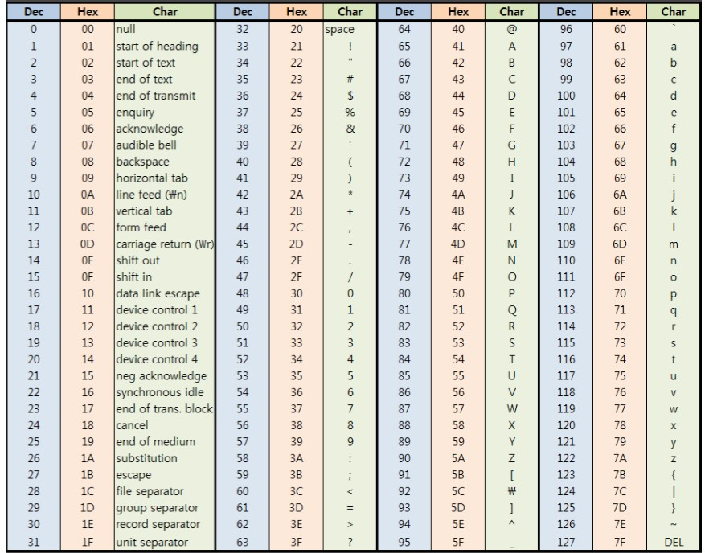
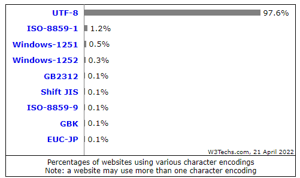
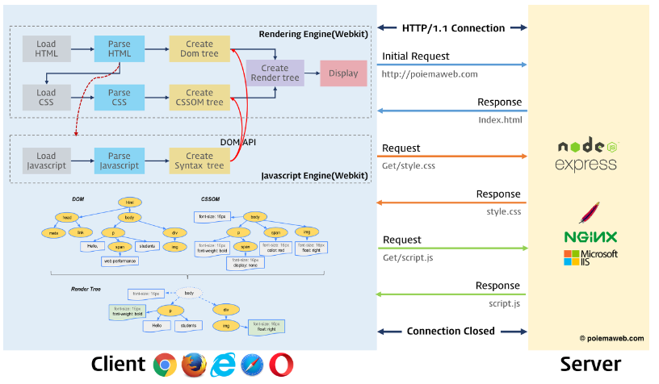
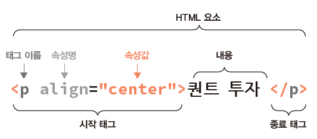
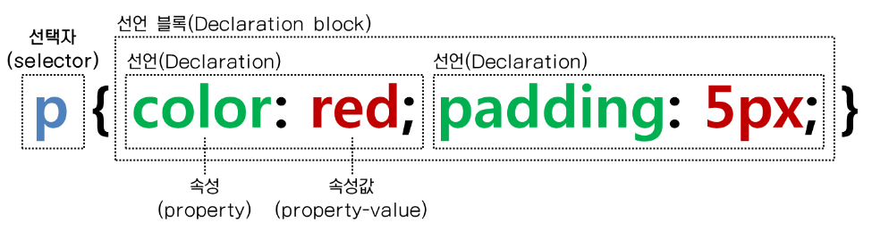

# Chapter7 크롤링을 위한 웹 기본 지식
## 7.1 인코딩에 대한 이해
### 7.1.1 인간과 컴퓨터 간 번역의 시작, ASCII
* 인코딩
  * 사람이 사용하는 언어를 컴퓨터가 사용하는 0과 1로 변환하는 과정
* 디코딩
  * 컴퓨터가 사용하는 0과 1을 사람이 사용하는 언어로 변환하는 과정
* 아스키 코드표
  
### 7.1.2 한글 인코딩 방식의 종류
* 한글 인코딩 방식
  * EUC-KR
    * 한글 문자 2350개에 번호를 붙인 방식
  * CP949
    * 윈도우즈 기본 인코딩 방식
    * 한글 문자 11720개에 번호를 붙인 방식
  * UTF-8
    * 모음과 자음 각각에 코드를 부여한 후 조합
  
## 7.2 웹의 동작 방식
* 클라이언트의 요청(request)과 서버의 응답(response)으로 구성

* HTTP 시퀀스

### 7.2.1 HTTP
* HTTP(HyperText Transfer Protocol)
  * 서버와 클라이언트의 통신 규약
* HTTP 요청 방식
  * GET
    * 특정 정보 조회
  * POST
    * 새로운 정보 등록
  * PUT
    * 기존 특정 정보 갱신
  * DELETE
    * 기존 특정 정보 삭제
* HTTP 응답 코드
  * 1xx
    * 조건부 응답
    * 요청을 받고 처리 중에 있음
  * 2xx
    * 성공
    * 요청을 정상적으로 처리함
  * 3xx
    * 리디렉션
    * 요청 완료를 위해 추가 동작이 필요함
  * 4xx
    * 클리이언트 오류
    * 클라이언트 요청을 처리할 수 없어 오류 발생
    * 400 - 잘못된 요청(파라미터 validation 실패)
    * 401 - 인증오류
    * 403 - 권한 없음
    * 404 - 페이지 없음
    * 405 - 메소드를 지원하지 않음
    * 415 - 미디어타입을 지원하지 않음
  * 5xx
    * 서버 오류
    * 서버에서 처리를 하지 못하여 오류 발생
## 7.3 HTML과 CSS
* HTML(Hyper Text Markup Language)
  * Hyper Text
    * 웹페이지에서 다른 페이지로 이동할 수 있음
  *  Markup Language
    * 태그 등을 이용하여 문서나 데이터의 구조를 표시
* CSS(Cascading Style Sheets)
  * 문서의 스타일를 꾸밀 때 사용하는 스타일 시트 언어
### 7.3.1 HTML 기본 구조
``` 
<html>
<head>
<title>Page Title</title>
</head>

<body>
<h2> This is page heading </h2>
<p> This is first paragraph text </p>
</body>
</html>
```
### 7.3.2 태그와 속성
* HTML 요소 분석

### 7.3.3 h 태그와 p 태그
* h 태그
  * 폰트의 크기를 나타내는 태그
* p 태그
  * 문단을 나타내는 태그
### 7.3.4 리스트를 나타내는 ui 태그와 ol 태그
* ul 태그
  * 순서가 없는 리스트
* ol 태그
  * 순서가 있는 리스트
### 7.3.5 table 태그
* table 태그
  * 표를 만드는 태그
### 7.3.6 a 태그와 img 태그 및 속성
* a 태그
  * 다른 페이지로 이동할 수 있는 링크를 설정할 수 있는 태그
* img 태그
  * 이미지를 불러오는 태그
### 7.3.7 div 태그
* div 태그
  * 레이아웃을 만들 때 사용하는 태그
### 7.3.8 CSS
* CSS 적용
  * style 태그 사용
  * CSS Rule set
  
``` 
<html>
<head>
<style>
body {background-color: powderblue;}
h4   {color: blue;}
</style>
</head>
<body>

<h4>This is a heading</h4>
<p>This is a first paragraph.</p>
<p>This is a second paragraph.</p>

</body>
</html>
```
### 7.3.9 클래스와 id
* 예제
``` 
<html>
<head>
<style>
.desc {
  background-color: moccasin;
  color: black;
  padding: 10px;
} 
#language {
  background-color: lightblue;
  color: black;
  padding: 15px;
  text-align: center;
}
</style>
</head>
<body>
<div>
  <h2 id="language">R</h2>
  <p class="desc">R is a free software environment for statistical computing and graphics.</p>
<div>
</body>
</html>
```