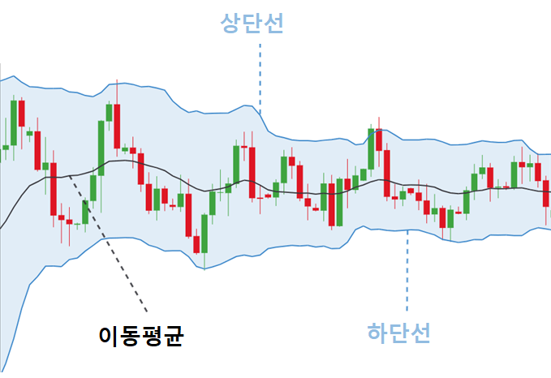
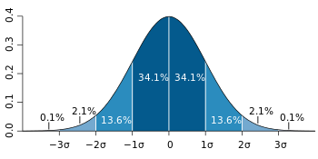

# Chapter15 트레이딩을 위한 기술적 지표
## 15.1 TA-Lib 패키지 설치하기
* 다운로드
  * https://www.lfd.uci.edu/~gohlke/pythonlibs/#ta-lib
* 설치
```
pip install .\TA_Lib-0.4.24-cp39-cp39-win_amd64.whl
```
* 지원하는 기술 지표
  * https://ta-lib.org/function.html
## 15.2 이동평균
* 단순 이동평균
* s&p500 다운로드
``` 
import yfinance as yf

stock_data = yf.download('^GSPC')
stock_data = stock_data.tail(500).copy()
```
* 20일, 60일 단순 이동평균 계산
``` 
import talib
import matplotlib.pyplot as plt

stock_data['SMA_20'] = talib.SMA(stock_data['Close'],
                                 timeperiod=20).copy()  # 20일 단순 이동평균
stock_data['SMA_60'] = talib.SMA(stock_data['Close'],
                                 timeperiod=60)  # 60일 단순 이동평균
stock_data[['Close', 'SMA_20', 'SMA_60']].plot(figsize=(10, 6))
plt.show()
```
* 60일 단순 이동평균 vs 60일 지수 이동평균
``` 
stock_data['EMA_60'] = talib.EMA(stock_data['Close'], 60)  # 60일 지수 이동평균
stock_data[['Close', 'SMA_60', 'EMA_60']].plot(figsize=(10, 6))
plt.show()
```

## 15.3 상대강도지수
* Relative Strength Index, RSI
* 일정 기간 주가의 상승폭과 하락폭의 크기를 비교해 상승과 하락의 상대적인 강도를 나타낸 지표
  * U(Up) : 가격이 상승한 날의 상승폭
  * D(Down) : 가격이 하락한 날의 하락폭
  * AU(Average Up) : U의 평균
  * AD(Average Down) : D의 평균
  * RS(Relative Strenth) = AU/AD
``` 
from matplotlib import gridspec

stock_data['RSI_14'] = talib.RSI(stock_data['Close'], timeperiod=14)
stock_data['RSI_14'].fillna(0, inplace=True)
fig = plt.subplots(figsize=(10, 6), sharex=True)
gs = gridspec.GridSpec(nrows=2, ncols=1, height_ratios=[2, 1])

# 주가 나타내기
ax1 = plt.subplot(gs[0])
ax1 = stock_data['Close'].plot()
ax1.set_xlabel('')
ax1.axes.xaxis.set_ticks([])

# RSI 나타내기
ax2 = plt.subplot(gs[1])
ax2 = stock_data['RSI_14'].plot(color='black', ylim=[0, 100])
ax2.axhline(y=70, color='r', linestyle='-')
ax2.axhline(y=30, color='r', linestyle='-')
ax2.set_xlabel
plt.subplots_adjust(wspace=0, hspace=0)

plt.show()
```
## 15.4 볼린저 밴드
* Bolinger band
* 이동평균선을 중심으로 일정 표준편차를 상한선과 하한선으로 설정한 밴드
* 중심 밴드 : n기간의 이동평균
* 상단 밴드 : 중심 밴드 기준 k 표준편차 위
* 하단 밴드 : 중심 밴드 기준 k 표준편차 아래
  * 
* 정규 분포
  * 
``` 
upper_3sd, mid_sd, lower_3sd = talib.BBANDS(stock_data['Close'],
                                             nbdevup=3,
                                             nbdevdn=3,
                                             timeperiod=20)

bb = pd.concat([upper_3sd, mid_sd, lower_3sd, stock_data['Close']], axis=1)
bb.columns = ['Upper Band', 'Mid Band', 'Lower Band', 'Close']
bb.plot(figsize=(10, 6),
        color={
            'Upper Band': 'red',
            'Lower Band': 'blue',
            'Mid Band': 'green',
            'Close': 'black'
        })
plt.show()
```

## 15.5 MACD
* Moving Average Convergence Divergence
* MACD(12, 26)의 의미
  * 단기 EMA(12) - 장기 EMA(26)
* MACD SIGNAL(9)의 의미 
  * MACD의 EMA(9)
``` 
from matplotlib import gridspec

macd_1226, macdsignal_9, macdhist = talib.MACD(stock_data['Close'], fastperiod=12, slowperiod=26, signalperiod=9)
macd = pd.concat([macd_1226, macdsignal_9, stock_data['Close']], axis=1)
macd.columns = ['MACD', 'SIGNAL', 'Close']
macd['MACD'].iloc[0] = 0
macd['SIGNAL'].iloc[0] = 0 
fig = plt.subplots(figsize=(10, 6), sharex=True)
gs = gridspec.GridSpec(nrows=2, ncols=1, height_ratios=[2, 1])

# 주가 나타내기
ax1 = plt.subplot(gs[0])
ax1 = macd['Close'].plot()
ax1.set_xlabel('')
ax1.axes.xaxis.set_ticks([])

# MACD 나타내기
ax2 = plt.subplot(gs[1])
ax2 = macd['MACD'].plot(color='green', ylim=[-120, 120])
ax2 = macd['SIGNAL'].plot(color='red', ylim=[-120, 120])
ax2.axhline(y=80, color='r', linestyle='-')
ax2.axhline(y=-80, color='r', linestyle='-')
ax2.set_xlabel
plt.subplots_adjust(wspace=0, hspace=0)

plt.show()
```