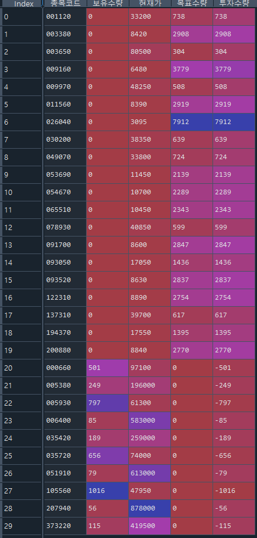

# Chapter17 증권사 API 연결과 매매하기
## 17.1 모의투자 및 API 서비스 신청하기
* 모의투자 계좌 개설
  * 한국투자증권 홈페이지 접속
  * 트레이딩 -> 모의투자 -> 주식/선물옵션 모의투자 -> 모의투자안내
* API 서비스 신청
  * 한국투자증권 홈페이지 접속
  * 트레이딩 -> Open API -> KIS Developers -> KIS Developers 서비스 신청하기
  * APP Key와 APP Secret 생성됨
* 
``` 
import keyring

# 모의계좌
keyring.set_password('mock_app_key', 'dukim', 'APP Key')
keyring.set_password('mock_app_secret', 'dukim', 'APP Secret')
```
## 17.2 접근 토큰 및 해시키 발급받기
* 한국투자 API 접근 방법
  * 
### 17.2.1 접근 토큰 발급받기
``` 
import requests
import json
import keyring

# key
app_key = keyring.get_password('mock_app_key', 'dukim')
app_secret = keyring.get_password('mock_app_secret', 'dukim')

# base url
url_base = "https://openapivts.koreainvestment.com:29443" # 모의투자

# information
headers = {"content-type": "application/json"}
path = "oauth2/tokenP"
body = {
    "grant_type": "client_credentials",
    "appkey": app_key,
    "appsecret": app_secret
}

url = f"{url_base}/{path}"

res = requests.post(url, headers=headers, data=json.dumps(body))
access_token = res.json()['access_token']
```
### 17.2.2 해시키 발급받기
``` 
def hashkey(datas):
    path = "uapi/hashkey"
    url = f"{url_base}/{path}"
    headers = {
        'content-Type': 'application/json',
        'appKey': app_key,
        'appSecret': app_secret,
    }
    res = requests.post(url, headers=headers, data=json.dumps(datas))
    hashkey = res.json()["HASH"]

    return hashkey
```

## 17.3 주식 현재가 시세 조회하기
``` 
path = "uapi/domestic-stock/v1/quotations/inquire-price"
url = f"{url_base}/{path}"

headers = {
    "Content-Type": "application/json",
    "authorization": f"Bearer {access_token}",
    "appKey": app_key,
    "appSecret": app_secret,
    "tr_id": "FHKST01010100" # 거래ID, 주식현재가를 나타냄
}

params = {"fid_cond_mrkt_div_code": "J", "fid_input_iscd": "005930"}

res = requests.get(url, headers=headers, params=params)
res.json()['output']['stck_prpr']
```

## 17.4 주식 주문하기
### 17.4.1 주식 주문 방법
* 지정가 주문
  * 지정한 금액으로 매매
  * CODE : 00
* 시장가 주문
  * 지정한 매수와 매도 물량을 호가를 올리며 전부 매매
  * CODE : 01
* 조건부 지정가
  * 지정한 금액으로 매매
  * 3시 20분에 시장가 주문으로 전환
  * CODE : 02
* 최유리 지정가
  * 매수 주문 -> 가장 낮은 매도 가격으로 지정가 주문
  * 매도 주문 -> 가장 높은 매수 가격으로 지정가 주문
  * CODE : 03
* 최우선 지정가
  * 매수 주문 -> 가장 높은 매도 가격으로 지정가 주문
  * 매도 주문 -> 가장 낮은 매도 가격으로 지정가 주문
  * CODE : 04
### 17.4.2 매수 주문
``` 
path = "/uapi/domestic-stock/v1/trading/order-cash"
url = f"{url_base}/{path}"

data = {
    "CANO": "50087375",  # 계좌번호 앞 8지리
    "ACNT_PRDT_CD": "01",  # 계좌번호 뒤 2자리
    "PDNO": "005930",  # 종목코드
    "ORD_DVSN": "01",  # 주문 방법, 시장가
    "ORD_QTY": "10",  # 주문 수량
    "ORD_UNPR": "0",  # 주문 단가 (시장가의 경우 0)
}

headers = {
    "Content-Type": "application/json",
    "authorization": f"Bearer {access_token}",
    "appKey": app_key,
    "appSecret": app_secret,
    "tr_id": "VTTC0802U", # 현금 매수
    "custtype": "P",
    "hashkey": hashkey(data)
}

res = requests.post(url, headers=headers, data=json.dumps(data))
res.json()
```
### 17.4.3 정정 주문
* 매수 주문
``` 
path = "/uapi/domestic-stock/v1/trading/order-cash"
url = f"{url_base}/{path}"

data = {
    "CANO": "50087375",  # 계좌번호 앞 8지리
    "ACNT_PRDT_CD": "01",  # 계좌번호 뒤 2자리
    "PDNO": "005930",  # 종목코드
    "ORD_DVSN": "00",  # 주문 방법, 지정가
    "ORD_QTY": "10",  # 주문 수량
    "ORD_UNPR": "50000",  # 주문 단가 (시장가의 경우 0)
}

headers = {
    "Content-Type": "application/json",
    "authorization": f"Bearer {access_token}",
    "appKey": app_key,
    "appSecret": app_secret,
    "tr_id": "VTTC0802U", # 현금 매수
    "custtype": "P",
    "hashkey": hashkey(data)
}

res = requests.post(url, headers=headers, data=json.dumps(data))
res.json()
```
* `한국거래소전송주문조직번호`와 `주문번호` 획득
``` 
KRX_FWDG_ORD_ORGNO = res.json()["output"][
    "KRX_FWDG_ORD_ORGNO"]  # 한국거래소전송주문조직번호
ODNO = res.json()["output"]["ODNO"]  # 주문번호

print(KRX_FWDG_ORD_ORGNO, ODNO)
```
* 정정 주문
```
path = "/uapi/domestic-stock/v1/trading/order-rvsecncl"
url = f"{url_base}/{path}"

data = {
    "CANO": "50087375",  # 계좌번호 앞 8지리
    "ACNT_PRDT_CD": "01",  #  계좌번호 뒤 2자리
    "KRX_FWDG_ORD_ORGNO": KRX_FWDG_ORD_ORGNO,  # 한국거래소전송주문조직번호
    "ORGN_ODNO": ODNO,  # 주문번호
    "ORD_DVSN": "03",  # 주문 방법, 최유리 지정가
    "RVSE_CNCL_DVSN_CD": "01",  # 정정 (취소는 02)  
    "ORD_QTY": "10",  # 주문 수량
    "ORD_UNPR": "0",  # 주문 단가 (시장가의 경우 0)
    "QTY_ALL_ORD_YN": "Y",  # 잔량 전부 (잔량 일부는 N)
}

headers = {
    "Content-Type": "application/json",
    "authorization": f"Bearer {access_token}",
    "appKey": app_key,
    "appSecret": app_secret,
    "tr_id": "VTTC0803U", # 주식 정정 취소 주문
    "custtype": "P",
    "hashkey": hashkey(data)
}

res = requests.post(url, headers=headers, data=json.dumps(data))
res.json()
```
### 17.4.4 매도 주문
``` 
path = "/uapi/domestic-stock/v1/trading/order-cash"
url = f"{url_base}/{path}"

data = {
    "CANO": "50087375",  # 계좌번호 앞 8지리
    "ACNT_PRDT_CD": "01",  # 계좌번호 뒤 2자리
    "PDNO": "005930",  # 종목코드
    "ORD_DVSN": "01",  # 주문 방법
    "ORD_QTY": "10",  # 주문 수량
    "ORD_UNPR": "0",  # 주문 단가 (시장가의 경우 0)
}

headers = {
    "Content-Type": "application/json",
    "authorization": f"Bearer {access_token}",
    "appKey": app_key,
    "appSecret": app_secret,
    "tr_id": "VTTC0801U", # 현금 매도
    "custtype": "P",
    "hashkey": hashkey(data)
}

res = requests.post(url, headers=headers, data=json.dumps(data))
```
## 17.5 주식 잔고조회
``` 
path = "/uapi/domestic-stock/v1/trading/inquire-balance"
url = f"{url_base}/{path}"

headers = {
    "Content-Type": "application/json",
    "authorization": f"Bearer {access_token}",
    "appKey": app_key,
    "appSecret": app_secret,
    "tr_id": "VTTC8434R"
}

params = {
    "CANO": "50087375",  # 계좌번호 앞 8지리
    "ACNT_PRDT_CD": "01",  # 계좌번호 뒤 2자리
    "AFHR_FLPR_YN": "N",  # 시간외단일가여부
    "OFL_YN": "",  # 공란
    "INQR_DVSN": "01",  # 조회구분
    "UNPR_DVSN": "01",  # 단가구분
    "FUND_STTL_ICLD_YN": "N",  # 펀드결제분포함여부
    "FNCG_AMT_AUTO_RDPT_YN": "N",  # 융자금액자동상환여부        
    "PRCS_DVSN": "00",  # 처리구분(00: 전일매매포함)
    "CTX_AREA_FK100": "",  # 연속조회검색조건
    "CTX_AREA_NK100": ""  # 연속조회키
}

res = requests.get(url, headers=headers, params=params)

res.json()['output1'] # 보유종목에 대한 정보
res.json()['output2'] # 계좌잔고에 대한 정보

ap = pd.DataFrame.from_records(res.json()['output1'])
ap
```
## 17.6 스케줄링
* schedule 패키지 이용
  * https://schedule.readthedocs.io/en/stable/examples.html
``` 
# pip install schedule
import datetime
import schedule

def job():
    print(datetime.datetime.now().strftime('%H:%M:%S'))    
    print("=====================")

schedule.every(3).seconds.do(job)

schedule.get_jobs()

schedule.run_pending()
schedule.run_pending()
schedule.run_pending()

schedule.clear()
```
### 17.6.1 시간 지정하기
```
import pandas as pd
from datetime import timedelta

schedule.clear()

startDt = datetime.datetime.now() + timedelta(seconds=60)
endDt = datetime.datetime.now() + timedelta(seconds=80)
time_list = pd.date_range(startDt, endDt, periods=5)

print(time_list)

time_list_sec = [i.strftime('%H:%M:%S') for i in time_list]
time_list_sec

[schedule.every().day.at(i).do(job) for i in time_list_sec]

while True:
    schedule.run_pending()
    if datetime.datetime.now() > endDt:
        print('End')
        schedule.clear()
        break
```

## 17.7 포트폴리오 리밸런싱
* 시분할 매매
  * Time Weighted Average Price, TWAP
  * 주문 시간을 여러 개로 나누어 조금씩 매수
* 구현 조건
  * 1주 단위 최유리 지정가 주문
  * 주문시간 : 9시 10분 ~ 3시
  * 국내 대형주 10개
### 17.7.1 포트폴리오 매수
* 키발급
``` 
import requests
import json
import keyring
import pandas as pd
import time
import numpy as np
import datetime
from datetime import timedelta
import schedule

# API Key
app_key = keyring.get_password('mock_app_key', 'dukim')
app_secret = keyring.get_password('mock_app_secret', 'dukim')

# 접근토큰 발급
url_base = "https://openapivts.koreainvestment.com:29443"  # 모의투자

headers = {"content-type": "application/json"}
path = "oauth2/tokenP"
body = {
    "grant_type": "client_credentials",
    "appkey": app_key,
    "appsecret": app_secret
}

url = f"{url_base}/{path}"
res = requests.post(url, headers=headers, data=json.dumps(body))
access_token = res.json()['access_token']

# 해시키 발급
def hashkey(datas):
    path = "uapi/hashkey"
    url = f"{url_base}/{path}"
    headers = {
        'content-Type': 'application/json',
        'appKey': app_key,
        'appSecret': app_secret,
    }
    res = requests.post(url, headers=headers, data=json.dumps(datas))
    hashkey = res.json()["HASH"]

    return hashkey
```
* 현재가 조회
``` 
# 현재가 구하기
def get_price(ticker):
    path = "uapi/domestic-stock/v1/quotations/inquire-price"
    url = f"{url_base}/{path}"

    headers = {
        "Content-Type": "application/json",
        "authorization": f"Bearer {access_token}",
        "appKey": app_key,
        "appSecret": app_secret,
        "tr_id": "FHKST01010100"
    }

    params = {"fid_cond_mrkt_div_code": "J", "fid_input_iscd": ticker}

    res = requests.get(url, headers=headers, params=params)
    price = res.json()['output']['stck_prpr']
    price = int(price)
    time.sleep(0.1)

    return price
```
* 주문
``` 
# 주문
def trading(ticker, tr_id):

    path = "/uapi/domestic-stock/v1/trading/order-cash"
    url = f"{url_base}/{path}"

    data = {
        "CANO": "50087375", # 계좌번호 앞 8지리
        "ACNT_PRDT_CD": "01",
        "PDNO": ticker,
        "ORD_DVSN": "03",
        "ORD_QTY": "1",
        "ORD_UNPR": "0",
    }

    headers = {
        "Content-Type": "application/json",
        "authorization": f"Bearer {access_token}",
        "appKey": app_key,
        "appSecret": app_secret,
        "tr_id": tr_id,
        "custtype": "P",
        "hashkey": hashkey(data)
    }

    res = requests.post(url, headers=headers, data=json.dumps(data)) 
```
* 잔고 조회
``` 
# 계좌 잔고 조회
def check_account():

    output1 = []
    output2 = []
    CTX_AREA_NK100 = ''

    while True:
        path = "/uapi/domestic-stock/v1/trading/inquire-balance"
        url = f"{url_base}/{path}"

        headers = {
            "Content-Type": "application/json",
            "authorization": f"Bearer {access_token}",
            "appKey": app_key,
            "appSecret": app_secret,
            "tr_id": "VTTC8434R"
        }

        params = {
            "CANO": "50087375", # 계좌번호 앞 8지리
            "ACNT_PRDT_CD": "01",
            "AFHR_FLPR_YN": "N",
            "UNPR_DVSN": "01",
            "FUND_STTL_ICLD_YN": "N",
            "FNCG_AMT_AUTO_RDPT_YN": "N",
            "OFL_YN": "",
            "INQR_DVSN": "01",
            "PRCS_DVSN": "00",
            "CTX_AREA_FK100": '',
            "CTX_AREA_NK100": CTX_AREA_NK100
        }

        res = requests.get(url, headers=headers, params=params)
        output1.append(pd.DataFrame.from_records(res.json()['output1']))

        CTX_AREA_NK100 = res.json()['ctx_area_nk100'].strip()

        if CTX_AREA_NK100 == '': # 연속조회 값이 없을 경우
            output2.append(res.json()['output2'][0])
            break

    if not output1[0].empty:
        res1 = pd.concat(output1)[['pdno',
                                   'hldg_qty']].rename(columns={
                                       'pdno': '종목코드',
                                       'hldg_qty': '보유수량'
                                   }).reset_index(drop=True)
    else:
        res1 = pd.DataFrame(columns=['종목코드', '보유수량'])

    res2 = output2[0]

    return [res1, res2] # [보유종목, 계좌잔고]
```
* 수량 계산
``` 
# 모델 포트폴리오
mp = pd.DataFrame({
    '종목코드': [
        '005930',  # 삼성전자
        '373220',  # LG에너지솔루션
        '000660',  # SK하이닉스
        '207940',  # 삼성바이오로직스
        '051910',  # LG화학
        '035420',  # NAVER
        '005380',  # 현대차
        '006400',  # 삼성SDI,
        '035720',  # 카카오
        '105560',  #KB금융
    ]
})

# 보유 종목과 계좌 정보 불러오기
ap, account = check_account()

# 주당 투자 금액
invest_per_stock = int(account['tot_evlu_amt']) * 0.98 / len(mp)

# 매매 구성
target = mp.merge(ap, on='종목코드', how='outer')
target['보유수량'] = target['보유수량'].fillna(0).apply(pd.to_numeric)

# 현재가 확인
target['현재가'] = target.apply(lambda x: get_price(x.종목코드), axis=1)

# 목표수량 및 투자수량 입력
target['목표수량'] = np.where(target['종목코드'].isin(mp['종목코드'].tolist()),
                          round(invest_per_stock / target['현재가']), 0)
target['투자수량'] = target['목표수량'] - target['보유수량']
```
* target
  * 
* TWAP
```
# 시간 분할
startDt1 = datetime.datetime.now() + timedelta(minutes=1)
startDt2 = datetime.datetime.now().replace(hour=9,minute=10,second=0,microsecond=0)
startDt = max(startDt1, startDt2)
endDt = datetime.datetime.now().replace(hour=15,minute=0,second=0,microsecond=0)

# 스케줄 초기화
schedule.clear()

# 스케줄 등록
for t in range(target.shape[0]) :
    n = target.loc[t, '투자수량']
    position = 'VTTC0802U' if n > 0 else 'VTTC0801U'
    ticker = target.loc[t, '종목코드']    
    
    time_list = pd.date_range(startDt, endDt, periods = abs(n)) # q가 10이라면 time_list는 10개의 시간 요소를 가짐    
    time_list = time_list.round(freq = 's').tolist()    
    time_list_sec = [s.strftime('%H:%M:%S') for s in time_list]                 

    for i in time_list_sec:
        schedule.every().day.at(i).do(trading, ticker, position)
```
* 스케줄 실행
``` 
# 스케줄 실행
while True:
    schedule.run_pending()    
    if datetime.datetime.now() > endDt :
        print('거래가 완료되었습니다.')        
        schedule.clear()
        break
```
### 17.7.2 포트폴리오 리밸런싱
* 대형주 10종목 -> 멀티팩터 포트폴리오 20종목 리밸런싱
* 파일 읽고 계좌 정보 가져오기
``` 
# 모델 포트폴리오
mp = pd.read_excel('model.xlsx', dtype=str)
ap, account = check_account()
```
* 매매 수량 계산
  * 
* 목표 수량과 실제 수량 비교
  * 
``` 
ap_after, account_after = check_account()        
ap_after.columns  = ['종목코드', '매매후수량']
ap_after['매매후수량'] = ap_after['매매후수량'].apply(pd.to_numeric)

target_after = target.merge(ap_after)
target_after['차이'] = target_after['목표수량'] - target_after['매매후수량']

target_after
```
### 17.7.3 실제 게좌 매매하기
* 실제 매수와 매도의 불일치
  * 동시 매수와 매도로 인한 금액 부족
* 해결책
  * 매수되지 않은 수량을 3시 이후에 매수하는 알고리즘 추가한다.
  * 매도의 경우 종료시간을 3시보다 앞당긴다.
  * 투자목표 비율을 낮춰서 현금 버퍼를 충분히 확보한다.